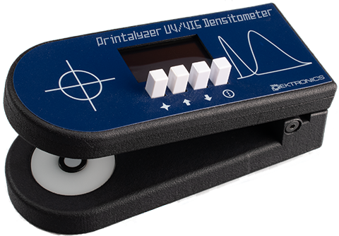

# Printalyzer UV/VIS Densitometer

## Introduction

The Printalyzer UV/VIS Densitometer is a project whose goal is the creation of an
affordable reflection and transmission densitometer for photographic darkroom
use.

It differs from the original B&W densitometer product in that it adds a UV
measurement channel for alternative processes needs.

This project will use the B&W [Printalyzer Densitometer](https://github.com/dektronics/printalyzer-densitometer) DPD-100 design as its basis, and will make all efforts to share the same mechanical design and components.

Eventually, this may be merged into the main project, or kept separate. That much is still TBD.

_**This project is currently very much in the R&D stage, and should not be considered complete or functional at this point. It may change substantially as initial prototypes are constructed and tested.**_

## Project Layout

### Hardware
The "hardware" directory contains [KiCad](https://www.kicad.org/) projects
with the complete circuit schematics, bill-of-materials, and
PCB layouts.

### Software
The "software" directory contains all the source code for the firmware
that runs on the hardware.

### Enclosure
The "enclosure" directory contains any CAD models and related resources
necessary to physically assemble the device.

## License
Individual directories will contain LICENSE files as needed, with relevant
details. Generally, the hardware will be CC BY-SA and the software will be
BSD 3-Clause. However, external resources may have their own individual license terms.
